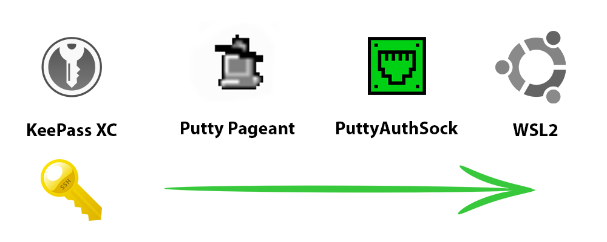

# PuttyAuthSock
### Accessing your KeePassXC / Pageant keys from within your WSL
**DISCLAIMER**: This project is not associated with the official Putty project in any way. This tool comes with no warranty whatsoever.
## About
  

Using the WSL (especially in version 2) is pretty cool. If you are like me organizing your SSH keys in **KeePassXC** and adding them automatically to **pageant** though, it is quite a hassle to get them reliably working in your WSL.  
  
  
*But fear no more*  

Because **PuttyAuthSock** has got you covered.

By automatically opening a ssh connection to your WSL with [Putty's agent forwarding](https://the.earth.li/~sgtatham/putty/0.74/htmldoc/Chapter9.html#pageant-forward) enabled.
This allows your WSL to access all the identities loaded to pageant running on windows.  
By using e.g. KeePassXC as password manager, you can load your identities to pageant upon unlocking your database and your WSL agent will be able to access these identities, eliminating the need for redundant key storage. 

## Installation
- First of all, make sure that You have **installed** the [Putty](https://www.chiark.greenend.org.uk/~sgtatham/putty/latest.html) and that plink is on your PATH (should be default when *installing* putty e.g. with the *.msi.  
  - For maximum comfort, **add pageant to your autostart**.
- You will need to install and configure OpenSSH server in your WSL
  - `sudo apt update && sudo apt install openssh-server`
- When you start your SSH server for the first time (use `sudo service ssh start`), it's likely that you'll need to do some configurations. Make sure to enable public key authentication.
  - Any subsequent starts of WSL's ssh server will be handled by PuttyAuthSock since the ssh server isn't starting at startup
- Next, you'll need to install your public and private key for authentication. For that
  - use puttygen on Windows to generate a putty private key file (.ppk), name it `putty_auth_sock.ppk` and place it in your user's `.ssh` directory  
  The final location should look like this:  
  `C:\Users\<your_windows_username>\.ssh\putty_auth_sock.ppk`
  - Install the corresponding public key in your WSL by appending the public key contents (or creating a new one if it doesn't exist) to `/home/<your_wsl_username>/.ssh/authorized_keys` 
- Last but not least, you have to register the `SSH_AUTH_SOCK` in your WSL console.  
  - Do so by appending `export SSH_AUTH_SOCK=~/.auth_sock` to your favourite shell's `rc` file
    - for **bash**: `echo "export SSH_AUTH_SOCK=~/.auth_sock" >> ~/.bashrc` 
    - for **zsh**: `echo "export SSH_AUTH_SOCK=~/.auth_sock" >> ~/.zshrc` 
    - for **fish**: `echo "export SSH_AUTH_SOCK=~/.auth_sock" >> ~/.config/fish/config.fish` 

Once that's done, you should be good to go and you can start using PuttyAuthSock

## Usage
- Since you have added pageant to your autostart (you really shoud) just go ahead and open KeePassXC to unlock your Database.
- To activate the PuttyAuthSock connection just click on the tray icon. Once the connection is established, it will turn green.
- If you want to close the connection again, click the tray icon again. It will terminate the connection and turn white again.

## Author
Made with &#9829;, pizza and beer by MaPa  
[![alt text][1.1]][1]
[![alt text][2.1]][2]
[![alt text][6.1]][6]

[1]: http://www.twitter.com/mxcd_
[2]: https://www.facebook.com/max.partenfelder
[6]: http://www.github.com/mxcd

[1.1]: http://i.imgur.com/tXSoThF.png (twitter icon with padding)
[2.1]: http://i.imgur.com/P3YfQoD.png (facebook icon with padding)
[6.1]: http://i.imgur.com/0o48UoR.png (github icon with padding)

<!-- Please don't remove this: Grab your social icons from https://github.com/carlsednaoui/gitsocial -->